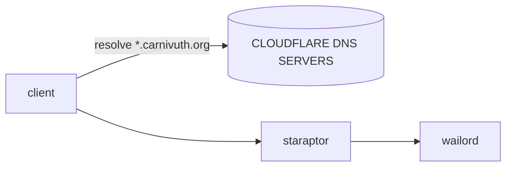

In order to expose different web applications to the public internet i decided to migrate my dns to [cloudflare](https://www.cloudflare.com). After migration the architecture looks like this



The operation involves the following steps:

- create dns records on [cloudflare dashboard](https://dash.cloudflare.com)

- changed [reverse proxy configuration](https://github.com/carnivuth/labcraft/commit/d55f66c80fcf24317873a36613daff72b8add1f8) to multiple site configurations

- reconfigure certbot to ask certificate for a wildcard name `*.carnivuth.org`

```bash
# install packet
apt install python3-certbot-dns-cloudflare

# create configuration file and secure permissions
sudo tee /etc/letsencrypt/dnscloudflare.ini > /dev/null <<EOT
# Cloudflare API token used by Certbot
dns_cloudflare_api_token = [TOKEN]
EOT
chmod 0600 /etc/letsencrypt/dnscloudflare.ini

# ask for certificate and tested with a dryrun
sudo certbot certonly -d *.carnivuth.org     --dns-cloudflare --dns-cloudflare-credentials /etc/letsencrypt/dnscloudflare.ini     --post-hook "service nginx reload"     --non-interactive --agree-tos     --email matti200042@gmail.com
certbot renew --dry-run
```

- migrated ddns daemon to update cloudflare records

```bash
apt install ddclient
```

- edited configuration as follows

```text
protocol=cloudflare \
use=web, web=ipify-ipv4 \
login=USER \
password='TOKEN' \
zone=carnivuth.org \
carnivuth.org
```

- enabled services

```bash
systemctl enable --now ddclient
```
