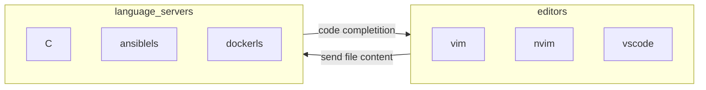

Brief guide to debug [neovim](https://neovim.io/) lsp server configuration

## LANGUAGE SERVER PROTOCOL RECAP

it's a standard protocol  to manage interaction between code editors and process providing code completion and  syntax highlighting



neovim provides integrated support as it feature a builtin lsp client, in my personal configuration this plugins are also enabled to improve the lsp management experience

- [mason](https://github.com/williamboman/mason.nvim) for lsp isntallation
- [lspconfig](https://github.com/neovim/nvim-lspconfig) for lsp configuration
- [mason-lspconfig](https://github.com/williamboman/mason-lspconfig.nvim) for automatic lsp management

## ADD A LANGUAGE SERVER

a language server needs to be installed with `mason` and then it needs to be activated with `lspconfig` then when the correspondent filetype is detected lspconfig will start the server and attach the client to it for the active buffer

```vimscript
:MasonInstall
:lua require("lspconfig").hyprls.setup{}
```

to check if a language server is running correctly run `:LspInfo`

```text
lspconfig: require("lspconfig.health").check()

LSP configs active in this session (globally)
- Configured servers: lua_ls, ansiblels, gopls, pyright, bashls, terraformls, docker_compose_language_service, dockerls, eslint
- OK Deprecated servers: (none)

LSP configs active in this buffer (bufnr: 1)
- Language client log: ~/.local/state/nvim/lsp.log
- Detected filetype: yaml
- 0 client(s) attached to this buffer

Docs for active configs:
```

## SETTING FILETYPE

In order to limit a language server to a specific set of files (*e.g. `ansiblels`*) configure lspconfig to run the lsp server on a specific filetype (`ansible`) and configure neovim to set the filetype for the specific set of file

```lua
-- in nvim filetypes configuration
vim.filetype.add({pattern = { [".*/playbooks/.*%.yml"] = "ansible" },})
vim.filetype.add({pattern = { [".*/playbooks/.*%.yaml"] = "ansible" },})
vim.filetype.add({pattern = { [".*/roles/.*%.yml"] = "ansible" },})
vim.filetype.add({pattern = { [".*/roles/.*%.yaml"] = "ansible" },})

-- in the lspconfig file
-------------------------------------
require('lspconfig').ansiblels.setup{
	filetypes ={"ansible"};
}
------------------------------------
```

the `pattern` objects requires a [lua pattern](https://www.lua.org/manual/5.1/manual.html#5.4.1) as argument


